# 100 Days of Design Engineering

Showcasing my journey through the '100 Days of Making' class, focusing on design engineering with web development, Next.js/React components, and WebGL.

## Table of Contents

- [100 Days of Design Engineering](#100-days-of-design-engineering)
  - [Table of Contents](#table-of-contents)
  - [Introduction](#introduction)
  - [Technologies Used](#technologies-used)
  - [Screenshots](#screenshots)
  - [Installation](#installation)

```mermaid
flowchart TB
    %% Global Entities
    Browser["Browser Client"]:::browser
    
    %% Main Flow Direction - Vertical from Browser down
    Browser -->|"HTTP_Request"| RootLayout
    
    %% Frontend Layers - Organized vertically
    RootLayout["Root Layout (layout.tsx)"]:::frontend
    
    %% Frontend Flow
    RootLayout -->|"renders"| HomePage["Home Page (page.tsx)"]:::frontend
    RootLayout -->|"renders"| DynamicDay["Dynamic Day Page ([slug]/page.tsx)"]:::frontend
    
    %% Dynamic Day Related Components
    DynamicDay -->|"shows_loading"| DayLoading["Day Loading ([slug]/loading.tsx)"]:::frontend
    DynamicDay -->|"generates"| Opengraph["Opengraph Image ([slug]/opengraph-image.tsx)"]:::frontend
    
    %% UI Layer connected to Root Layout
    RootLayout ---|"includes"| UIDir["UI Components Directory"]:::ui
    
    %% UI Components
    UIDir --> Navbar["Navbar (Navbar.tsx)"]:::ui
    UIDir --> Footer["Footer (Footer.tsx)"]:::ui
    UIDir --> ThemeSwitch["ThemeSwitch (ThemeSwitch.tsx)"]:::ui
    UIDir --> ElementShowcase["ElementShowcase (ElementShowcase.tsx)"]:::ui
    UIDir --> FeedbackBar["FeedbackBar (FeedbackBar.tsx)"]:::ui
    
    %% UI Integration with Elements
    UIDir -->|"integrates"| Elements["Interactive Elements (src/elements)"]:::elements
    
    %% Content and Resources
    DynamicDay -->|"loads"| Content["Markdown Content (src/content)"]:::content
    DynamicDay -->|"loads"| Assets["Public Assets (public/assets)"]:::assets
    DynamicDay -->|"utilizes"| UtilLib["Utilities & Library (src/lib & src/types)"]:::util
    
    %% Home Page Connections
    HomePage -->|"loads"| Content
    
    %% Admin & API Section
    HomePage -->|"admin_access"| AdminFeedback["Admin Feedback (feedback/page.tsx)"]:::api
    AdminFeedback -->|"calls"| APIFeedback["API Feedback (src/app/api/feedback)"]:::api
    AdminFeedback -->|"calls"| APIProject["API Project (src/app/api/project)"]:::api
    
    %% Subgraph Definitions - Organized for vertical flow
    subgraph "Next.js Frontend Application"
        subgraph "Layout & Routing"
            RootLayout
            HomePage
            DynamicDay
            DayLoading
            Opengraph
        end
        subgraph "UI Components Layer"
            UIDir
            Navbar
            Footer
            ThemeSwitch
            ElementShowcase
            FeedbackBar
        end
    end
    
    subgraph "Admin & API Endpoints"
        AdminFeedback
        APIFeedback
        APIProject
    end

    %% Click Events for Next.js Frontend Application (Layout & Routing)
    click RootLayout "https://github.com/alanvww/100-days-of-design-engineering/blob/main/src/app/layout.tsx"
    click HomePage "https://github.com/alanvww/100-days-of-design-engineering/blob/main/src/app/page.tsx"
    click DynamicDay "https://github.com/alanvww/100-days-of-design-engineering/blob/main/src/app/days/[slug]/page.tsx"
    click DayLoading "https://github.com/alanvww/100-days-of-design-engineering/blob/main/src/app/days/[slug]/loading.tsx"
    click Opengraph "https://github.com/alanvww/100-days-of-design-engineering/blob/main/src/app/days/[slug]/opengraph-image.tsx"

    %% Click Events for Admin & API Endpoints
    click AdminFeedback "https://github.com/alanvww/100-days-of-design-engineering/blob/main/src/app/admin/feedback/page.tsx"
    click APIFeedback "https://github.com/alanvww/100-days-of-design-engineering/tree/main/src/app/api/feedback"
    click APIProject "https://github.com/alanvww/100-days-of-design-engineering/tree/main/src/app/api/project"

    %% Click Events for UI Components Layer
    click UIDir "https://github.com/alanvww/100-days-of-design-engineering/tree/main/src/components/ui"
    click Navbar "https://github.com/alanvww/100-days-of-design-engineering/blob/main/src/components/ui/Navbar.tsx"
    click Footer "https://github.com/alanvww/100-days-of-design-engineering/blob/main/src/components/ui/Footer.tsx"
    click ThemeSwitch "https://github.com/alanvww/100-days-of-design-engineering/blob/main/src/components/ui/ThemeSwitch.tsx"
    click ElementShowcase "https://github.com/alanvww/100-days-of-design-engineering/blob/main/src/components/ElementShowcase.tsx"
    click FeedbackBar "https://github.com/alanvww/100-days-of-design-engineering/blob/main/src/components/FeedbackBar.tsx"

    %% Click Event for Interactive Elements
    click Elements "https://github.com/alanvww/100-days-of-design-engineering/tree/main/src/elements"

    %% Click Event for Content Repository
    click Content "https://github.com/alanvww/100-days-of-design-engineering/tree/main/src/content"

    %% Click Event for Public Assets
    click Assets "https://github.com/alanvww/100-days-of-design-engineering/tree/main/public/assets"

    %% Click Event for Utility & Library Files
    click UtilLib "https://github.com/alanvww/100-days-of-design-engineering/tree/main/src/lib"

    %% Styles
    classDef browser fill:#ffcc00,stroke:#333,stroke-width:2px;
    classDef frontend fill:#99ccff,stroke:#333,stroke-width:2px;
    classDef ui fill:#a6d854,stroke:#333,stroke-width:2px;
    classDef api fill:#f6ab6c,stroke:#333,stroke-width:2px;
    classDef content fill:#8cd3ff,stroke:#333,stroke-width:2px;
    classDef assets fill:#f4a7b9,stroke:#333,stroke-width:2px;
    classDef util fill:#ffd966,stroke:#333,stroke-width:2px;
    classDef elements fill:#b4a7d6,stroke:#333,stroke-width:2px;
```


## Introduction

This repository documents my experience in the '100 Days of Making' class. Throughout this journey, I delved into design engineering with a strong focus on web development using Next.js/React components and WebGL. The goal was to build a variety of projects, each designed to enhance my skills and knowledge in design engineering.

## Technologies Used

- **TypeScript**: 98.3%
- **CSS**: 1.4%
- **JavaScript**: 0.3%
- **Next.js**
- **React**
- **WebGL**

## Screenshots

Here are some screenshots of the site:


## Installation

To get a local copy up and running, follow these simple steps.

1. Clone the repo

```sh
   git clone https://github.com/alanvww/100-Days-of-Design-Engineering.git
```

2. Install [Bun](https://bun.sh) and use it to install packages

```sh
   bun install
```
